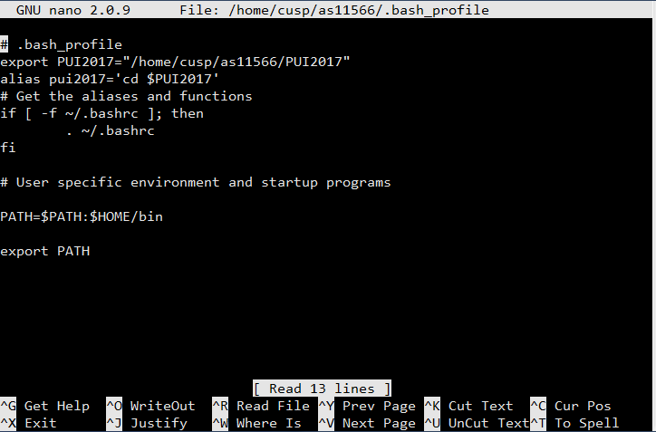
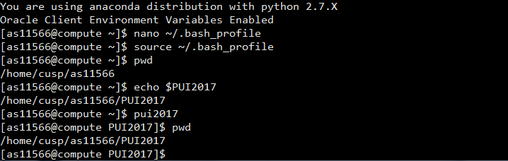

# Assignment 2
**Setting up the environment:**

1. Created a directory on CUSP compute called PUI2017. 

2. Created an environmental variable PUI2017 that points to that directory

3. Created an Alias that takes me to PUI2017

3. Saved it in my bash profile

Below are the screenshots:

